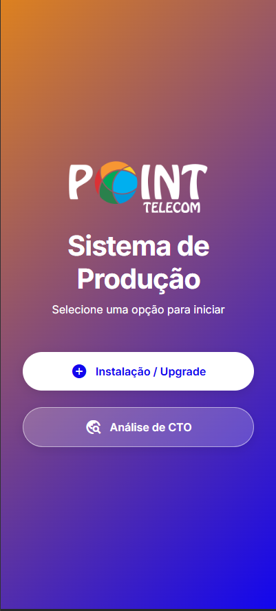
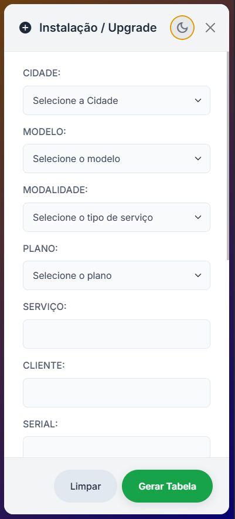
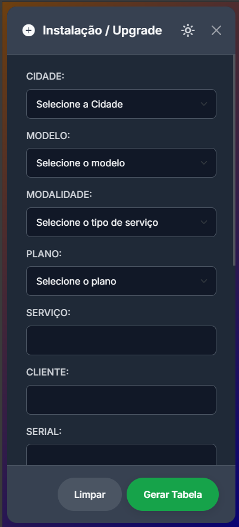

# ⚙️ Sistema de Produção

> Uma ferramenta web e aplicativo Android desenvolvida para técnicos de telecomunicações, focada em agilizar e padronizar os processos de provisionamento de equipamentos e análise de caixas de atendimento.

### 🖼️ Pré-Visualização da Interface

| Tela Principal | Modo Claro | Modo Noturno |
| :---: | :---: | :---: |
|  |  |  |

---

## ✨ Funcionalidades Principais

Este projeto foi construído do zero com foco em usabilidade e eficiência, incorporando diversas funcionalidades modernas:

* **Design Responsivo e Moderno:** Interface limpa que se adapta perfeitamente a qualquer tamanho de tela, de celulares a desktops.
* **Tema Claro e Escuro (Dark Mode):** Um botão de fácil acesso permite alternar entre os temas, e a preferência do usuário é salva no dispositivo para visitas futuras.
* **Animações Fluidas:** Utilizando a biblioteca `anime.js`, a interface conta com animações sutis na entrada de elementos, proporcionando uma experiência de usuário mais agradável.
* **Dois Módulos Principais:**
    * **Instalação / Upgrade:** Formulário completo para registrar todos os dados de uma nova instalação ou upgrade de equipamento (ONU).
    * **Análise de CTO:** Ferramenta para documentar o estado das portas em uma caixa de atendimento.
* **Validação de Formulário Avançada:**
    * Verificação de campos obrigatórios, com destaque visual para campos não preenchidos.
    * **Filtro de Palavras Proibidas:** Um sistema inteligente impede o uso de palavras inadequadas ou de concorrentes no nome da rede Wi-Fi, protegendo a imagem da empresa.
    * Lógica condicional para mostrar/ocultar campos (como Wi-Fi/Senha) com base no modelo do equipamento e na modalidade do serviço.
* **Pop-ups (Modais) Inteligentes:**
    * Alertas visuais e contextuais substituem os alertas padrão do navegador.
    * Pop-ups de confirmação para ações específicas, como na escolha de certas modalidades de serviço.
    * Mensagens de sucesso que desaparecem automaticamente.
* **Funcionalidades Nativas:**
    * **Geolocalização:** Botão "Obter Localização" que captura as coordenadas GPS do dispositivo com um clique.
    * **Copiar e Compartilhar:** Botões para copiar a tabela de dados gerada ou compartilhá-la diretamente em outros aplicativos, como o WhatsApp (totalmente funcional no app Android).

---

## 🛠️ Tecnologias Utilizadas

* **HTML5:** Estrutura semântica e moderna.
* **CSS3:** Estilização avançada com Flexbox e variáveis para fácil customização.
* **Bootstrap 5:** Framework CSS para garantir a responsividade e a base dos componentes visuais, como os modais.
* **JavaScript (ES6+):** O cérebro do projeto, responsável por toda a interatividade, lógica de formulários e validações.
* **Anime.js:** Biblioteca de animação para dar vida à interface.

---

## 💻 Como Utilizar

### Versão Web

A aplicação pode ser acessada diretamente pelo navegador através do seguinte link:

* **[https://point952.github.io/Tecnico/](https://point952.github.io/Tecnico/)**

Esta versão é totalmente funcional e recomendada para usuários de iPhone ou para acesso rápido via desktop.

### 📱 Aplicativo Android

Para uma experiência mais integrada em dispositivos Android, foi criado um aplicativo dedicado.

* **Download:** A versão mais recente do arquivo de instalação (`.apk`) pode ser encontrada na seção de **[Releases do Repositório](https://github.com/point952/Tecnico/releases)**.
* **Funcionalidades Nativas:** O aplicativo Android garante o funcionamento de todos os recursos, como o compartilhamento direto e a persistência do tema escuro, além de não perder dados ao girar a tela.

---

## 📄 Licença

Este projeto é de uso interno e proprietário.

---

## 👤 Contato

Desenvolvido e mantido por [Seu Nome Aqui].
